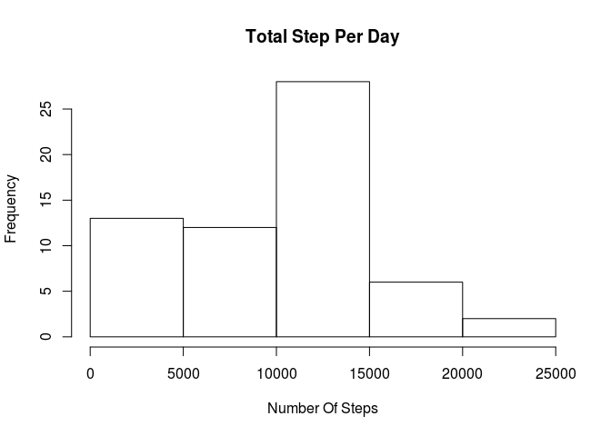

# Reproducible Research: Peer Assessment 1


## Loading and preprocessing the data
### set the working directory

```r
#setwd("./DataScience/ReproducibleResearch/Assignment1")
```

### set global options


```r
# Always make code visible
echo = TRUE  
```

### load the necessary library

```r
library(plyr)
library(reshape)
```

```
## 
## Attaching package: 'reshape'
## 
## The following objects are masked from 'package:plyr':
## 
##     rename, round_any
```

```r
library(lattice)
```
read off the initial data

```r
activity <- read.csv(file="data/activity.csv", na.strings = "NA", stringsAsFactors = FALSE)
```

## What is mean total number of steps taken per day?
Calculate the total number of steps taken per day

```r
# get the total of steps by date, remove na
total_step.df <- tapply(activity$steps, activity$date, FUN = sum, na.rm = TRUE)
```

Make a histogram of the total number of steps taken each day

```r
# plot the histogram
hist(total_step.df, main = "Total Step Per Day", xlab ="Number Of Steps")
```

 

Calculate and report the mean and median of the total number of steps taken per day

```r
# pivot the data set
total_step_list <- melt(total_step.df, id=c("date"))

# reset the column name
colnames(total_step_list) <- c('date', 'step')
```

Get the mean of the total number of steps taken per day

```r
mean(total_step_list[,2])
```

```
## [1] 9354.23
```
Get the median of the total number of steps taken per day

```r
median(total_step_list[,2])
```

```
## [1] 10395
```

## What is the average daily activity pattern?
Prepare data to answer the question

```r
# pivot the data set
total_step_list <- melt(total_step.df, id=c("date"))

# reset the column name
colnames(total_step_list) <- c('date', 'step')

# get the average of steps
mean(total_step_list[,2])
```

```
## [1] 9354.23
```

```r
# get the median of steps
median(total_step_list[,2])
```

```
## [1] 10395
```

```r
# get the average interval and step
avgInterval <- aggregate(steps ~ interval, data = activity, mean, na.rm = TRUE)
```

Make a time series plot of the 5-minute interval (x-axis) and the average number of steps taken, averaged across all days (y-axis)

```r
# plot the average result set
plot(x = avgInterval$interval, y = avgInterval$steps, type="l", main ="Average Daily Activity Pattern", xlab="Interval", ylab="Steps" )
```

 

Find the steps for max interval

```r
avgInterval[which(avgInterval[, 2] == max(avgInterval[, 2])),]
```

```
##     interval    steps
## 104      835 206.1698
```


## Inputing missing values


```r
# dup original data set
filled_activity <- activity
```
Calculate and report the total number of missing values in the dataset (i.e. the total number of rows with NAs)

```r
# find out how many NA there are to verify the result
sum(!complete.cases(filled_activity))
```

```
## [1] 2304
```
Devise a strategy for filling in all of the missing values in the dataset. The strategy does not need to be sophisticated. For example, you could use the mean/median for that day, or the mean for that 5-minute interval, etc:

My strategy is to for loop the new dataset and replace the NA value with the avg step
Create a new dataset that is equal to the original dataset but with the missing data filled in

```r
# use for loop to fill in the NA with average dataset
for (i in 1:nrow(filled_activity)){
  if(is.na(filled_activity$steps[i])){
    filled_activity$steps[i] <- avgInterval[which(filled_activity$interval[i] == avgInterval$interval), ]$steps
  }
  
}
```
Verify the data set to ensure there is no more NA

```r
# find out how many NA there are to verify the result
sum(!complete.cases(filled_activity))
```

```
## [1] 0
```
Calculate the mean of steps from the filled dataset

```r
# calculate the mean of steps from the filled dataset
total_step_filled.df <- tapply(filled_activity$steps, filled_activity$date, FUN = sum, na.rm = TRUE)
```
Make a histogram of the total number of steps taken each day and Calculate and report the mean and median total number of steps taken per day. Do these values differ from the estimates from the first part of the assignment? What is the impact of imputing missing data on the estimates of the total daily number of steps?

Make a histogram of the total number of steps taken each day

```r
# Plot the histogram of the filled dataset.
hist(total_step_filled.df, main = "Total Step Pers Day", xlab ="Number Of Steps")
```

 

Calculate and report the mean and median total number of steps taken per day

```r
# pivot the result set
total_step_filled <- melt(total_step_filled.df, id=c("date"))

# Rename columns
colnames(total_step_filled) <- c('date', 'step')
```

Find out the mean of filled dataset

```r
# Find out the mean of filled dataset
mean(total_step_filled[,2])
```

```
## [1] 10766.19
```

Find out the median of filled dataset

```r
# Find out the median of filled dataset
median(total_step_filled[,2])
```

```
## [1] 10766.19
```
Do these values differ from the estimates from the first part of the assignment? What is the impact of imputing missing data on the estimates of the total daily number of steps?

```r
# put original mean/median and new mean/median into variables.  Then compare the result.
original_mean <- mean(total_step_list[,2])

original_median <- median(total_step_list[,2])

new_mean <- mean(total_step_filled[,2])

new_median <- median(total_step_filled[,2])
```

Difference between original mean and mean of filled data

```r
original_mean - new_mean
```

```
## [1] -1411.959
```

Difference between original median and median of filled data

```r
original_median - new_median
```

```
## [1] -371.1887
```
The value is different between original data set and using average steps filled in dataset.  Overall, after using average steps to fill in missing steps, it increased the mean/median for the new dataset.

## Are there differences in activity patterns between weekdays and weekends?
Create a new factor variable in the dataset with two levels – “weekday” and “weekend” indicating whether a given date is a weekday or weekend day.

```r
# Add a new column to indicate whether the date is weekday or weekend 
filled_activity$day = ifelse(as.POSIXlt(as.Date(filled_activity$date))$wday%%6 == 0, "weekend", "weekday")

# For Sunday and Saturday : weekend, Other days : weekday
filled_activity$day = factor(filled_activity$day, levels = c("weekday", "weekend"))

# Calculate the means
filled_activity_mean = aggregate(steps ~ interval + day, filled_activity, mean)
```
Make a panel plot containing a time series plot (i.e. type = "l") of the 5-minute interval (x-axis) and the average number of steps taken, averaged across all weekday days or weekend days (y-axis).

```r
# Plot the result using xyplot
xyplot(steps ~ interval | factor(day), data = filled_activity_mean, aspect = 1/2, 
       type = "l")
```

 
